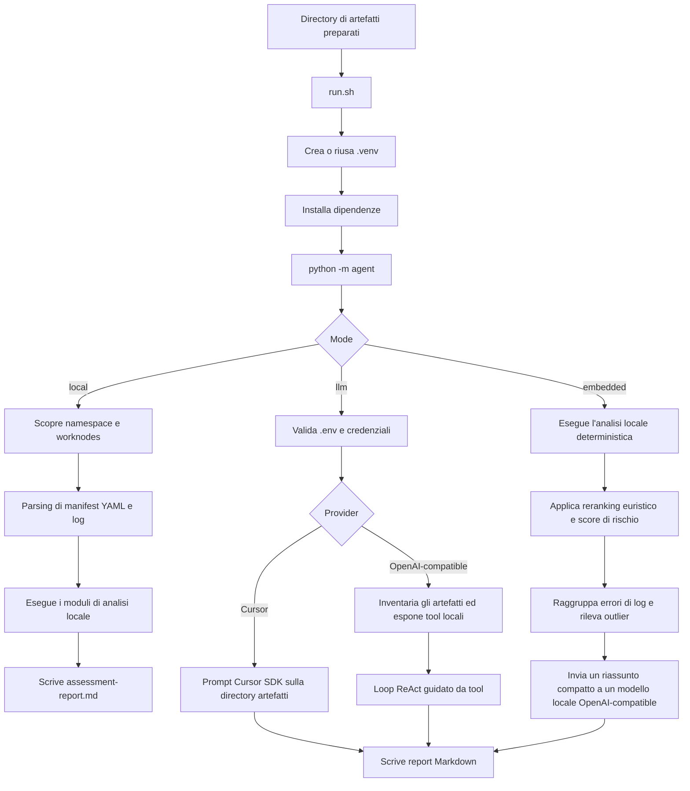

# kubeoptix-analyzer

Analizzatore offline per artefatti di applicazioni OpenShift e Kubernetes. Legge manifest, log e inventari dei worker node gia raccolti e genera un unico report Markdown.

Versioni del documento: [English](README.md) | [PT-BR](README.pt-BR.md)

## Panoramica

Questo progetto e la fase di analisi del flusso KubeOptix.

- `kubeoptix-harvester` si collega a un cluster OpenShift attivo, raccoglie gli artefatti, rimuove i manifest `Secret` e anonimizza i valori sensibili.
- `kubeoptix-analyzer` consuma questi artefatti preparati e produce un report di assessment.

Il processo upstream di estrazione e trattamento dei dati e documentato nel README del harvester:

- https://github.com/ShiftWise-AI/kubeoptix-harvester/blob/main/README.md

Secondo quel documento, la pipeline degli artefatti e:

1. Raccogliere i manifest dei worker node.
2. Raccogliere le risorse dei namespace e i log dei pod.
3. Rimuovere i file YAML il cui `kind` e `Secret`.
4. Anonimizzare in-place i pattern sensibili, inclusi email, token, certificati, chiavi e altri segreti.

Questo analyzer presume che questi passaggi siano gia stati eseguiti prima dell'analisi.

## Requisiti

- Python 3.9+
- Bash
- Una directory di artefatti prodotta da `kubeoptix-harvester` o da un altro collector compatibile

## Installazione

```bash
python3 -m venv .venv
source .venv/bin/activate
python -m pip install --upgrade pip
python -m pip install -r requirements.txt
```

## Layout di input supportato

L'analyzer supporta entrambi i layout seguenti.

1. Layout centrato sulle risorse:

```text
<artifacts>/
  worknodes/
  <namespace>/
    resources/
      deployments.apps/
      services/
      routes.route.openshift.io/
      configmaps/
      pods/
      horizontalpodautoscalers.autoscaling/
      servicemonitors.monitoring.coreos.com/
      podmonitors.monitoring.coreos.com/
      prometheusrules.monitoring.coreos.com/
      clusterserviceversions.operators.coreos.com/
      subscriptions.operators.coreos.com/
      packagemanifests.packages.operators.coreos.com/
    pods-logs/
```

2. Layout legacy centrato sull'applicazione:

```text
<artifacts>/
  <namespace>/
    apps/
      <app>/
        deployments/
        services/
        routes/
        configmaps/
        hpa/
        pod-logs/
```

## Configurazione

La CLI carica le variabili da `.env` nella root del progetto.

Esempio:

```dotenv
CURSOR_API_KEY=
CURSOR_MODEL=composer-2.5

# Provider OpenAI-compatible alternativo
# LLM_API_KEY=
# LLM_BASE_URL=https://api.openai.com/v1
# LLM_MODEL=gpt-4o-mini
```

La modalita LLM ora valida il file `.env` prima dell'esecuzione:

- se `.env` non esiste, l'esecuzione si interrompe con un errore leggibile
- se `CURSOR_API_KEY` e `LLM_API_KEY` sono entrambe vuote, l'esecuzione si interrompe con un errore leggibile

La modalita embedded usa un endpoint locale OpenAI-compatible. Esempio con Ollama e una variante quantizzata di Mistral 7B Instruct:

```dotenv
EMBEDDED_BASE_URL=http://127.0.0.1:11434/v1
EMBEDDED_API_KEY=ollama
EMBEDDED_MODEL=mistral
EMBEDDED_TIMEOUT_S=120
```

## Lingua del report

La CLI supporta l'internazionalizzazione del report tramite il parametro `--locale`.

Valori supportati:

- `pt-BR` (predefinito)
- `en-US`
- `es-ES`
- `it-IT`

Se `--locale` non viene specificato, il report viene generato in `pt-BR`.

## Flusso di esecuzione

### 1. Preparare o raccogliere gli artefatti

Usa prima `kubeoptix-harvester` per esportare i dati del cluster, rimuovere i manifest `Secret` e anonimizzare il contenuto sensibile.

### 2. Installare le dipendenze

```bash
./run.sh --help
```

Alla prima esecuzione dello script wrapper, esso:

1. Determina la root del progetto.
2. Crea `.venv/` se non esiste.
3. Attiva l'ambiente virtuale.
4. Aggiorna `pip`.
5. Installa le dipendenze da `requirements.txt`.
6. Avvia `python -m agent` con gli stessi argomenti CLI.

### 3. Eseguire l'analyzer

Modalita locale:

```bash
./run.sh --artifacts ./artifacts
```

Modalita LLM:

```bash
./run.sh --artifacts ./artifacts --mode llm
```

Modalita embedded:

```bash
./run.sh --artifacts ./artifacts --mode embedded
```

Locale personalizzato:

```bash
./run.sh --artifacts ./artifacts --mode local --locale en-US
./run.sh --artifacts ./artifacts --mode embedded --locale es-ES
./run.sh --artifacts ./artifacts --mode llm --locale it-IT
```

Percorso personalizzato del report:

```bash
./run.sh --artifacts ./artifacts --report ./out/assessment-report.md
```

### 4. Scegliere la modalita di analisi

`local`

- analisi deterministica senza chiamate esterne a LLM
- esamina manifest, routes, services, ConfigMaps, log, operatori, HPA e capacita dei worker node
- scrive un report Markdown unico basato su euristiche locali
- traduce il Markdown finale nel locale selezionato con `--locale`

`llm`

- valida che `.env` esista e contenga credenziali
- se `CURSOR_API_KEY` e impostata, usa Cursor SDK
- altrimenti, se `LLM_API_KEY` e impostata, usa una API OpenAI-compatible e un loop ReAct guidato da tool
- scrive un unico report Markdown nella directory degli artefatti o nel percorso passato con `--report`
- istruisce il modello a rispondere nel locale selezionato con `--locale`

`embedded`

- esegue prima l'analisi locale deterministica
- calcola classificazione euristica + reranking dei findings
- raggruppa gli errori di log ripetuti per firma normalizzata
- calcola un punteggio di rischio per workload usando findings, log, QoS, assenza di limits/requests e postura delle repliche
- rileva outlier di requests/limits con analisi basata su IQR
- invia solo un riassunto compatto delle evidenze a un modello locale OpenAI-compatible, come Ollama + Mistral
- traduce il Markdown finale nel locale selezionato con `--locale`

### 5. Verificare l'output

Per default, il file generato e:

```text
<artifacts>/assessment-report.md
```

Il report copre inventario, topologia, risorse, osservabilita, controlli di sicurezza sui ConfigMap, findings, action plan e riferimenti.

## Flusso interno dell'analyzer



## Cosa analizza la modalita locale

- scoperta dei namespace
- inventario delle applicazioni
- topologia inferita da Deployments, Services, Routes e ConfigMaps
- requests e limits di CPU e memoria
- totali allocatable e capacity dei worker node
- risorse correlate a HPA e osservabilita
- pattern di errore nei log come crash, OOM, timeout e fallimenti di connessione
- pattern rischiosi di configurazione in manifest e ConfigMaps
- inventario degli operatori da CSV, Subscriptions e PackageManifests

## Comandi principali

Mostrare l'help della CLI:

```bash
python -m agent --help
```

Eseguire direttamente l'analisi locale:

```bash
python -m agent --artifacts ./artifacts --mode local
```

Eseguire direttamente l'analisi LLM:

```bash
python -m agent --artifacts ./artifacts --mode llm
```

Eseguire direttamente l'analisi embedded:

```bash
python -m agent --artifacts ./artifacts --mode embedded
```

Eseguire con un locale specifico:

```bash
python -m agent --artifacts ./artifacts --mode local --locale en-US
```

## Note

- L'analyzer e offline rispetto al cluster. Legge solo artefatti locali.
- La qualita del report dipende dalla completezza degli artefatti raccolti.
- La modalita LLM non sostituisce la sanitizzazione degli artefatti. La rimozione dei dati sensibili deve avvenire prima, nella pipeline del harvester.

## Versioni del documento

- [English](README.md)
- [PT-BR](README.pt-BR.md)
- [Italiano](README.it.md)