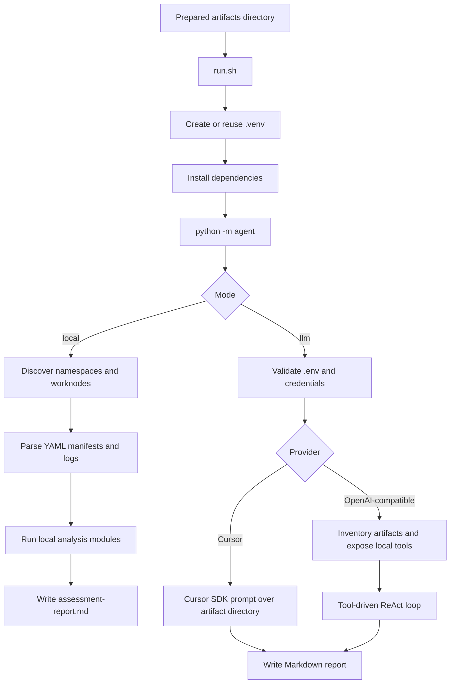

# kubeoptix-analyzer

Offline analyzer for OpenShift and Kubernetes application artifacts. It reads previously collected manifests, logs, and worker-node inventories, then generates a single Markdown assessment report.

Language versions: [PT-BR](README.pt-BR.md) | [Italiano](README.it.md)

## Overview

This project is the analysis stage of the KubeOptix workflow.

- `kubeoptix-harvester` connects to a live OpenShift cluster, collects artifacts, removes `Secret` manifests, and anonymizes sensitive values.
- `kubeoptix-analyzer` consumes those prepared artifacts and produces an assessment report.

The upstream extraction and data-treatment process is documented in the harvester README:

- https://github.com/ShiftWise-AI/kubeoptix-harvester/blob/main/README.md

According to that document, the artifact pipeline is:

1. Collect worker-node manifests.
2. Collect namespace resources and pod logs.
3. Remove YAML files whose `kind` is `Secret`.
4. Anonymize sensitive patterns in-place, including emails, tokens, certificates, keys, and other secrets.

This analyzer assumes those steps already happened before analysis starts.

## Requirements

- Python 3.9+
- Bash
- An artifact directory produced by `kubeoptix-harvester` or another compatible collector

## Installation

```bash
python3 -m venv .venv
source .venv/bin/activate
python -m pip install --upgrade pip
python -m pip install -r requirements.txt
```

## Supported input layout

The analyzer supports both of these layouts:

1. Resource-centric layout:

```text
<artifacts>/
  worknodes/
  <namespace>/
    resources/
      deployments.apps/
      services/
      routes.route.openshift.io/
      configmaps/
      pods/
      horizontalpodautoscalers.autoscaling/
      servicemonitors.monitoring.coreos.com/
      podmonitors.monitoring.coreos.com/
      prometheusrules.monitoring.coreos.com/
      clusterserviceversions.operators.coreos.com/
      subscriptions.operators.coreos.com/
      packagemanifests.packages.operators.coreos.com/
    pods-logs/
```

2. Legacy app-centric layout:

```text
<artifacts>/
  <namespace>/
    apps/
      <app>/
        deployments/
        services/
        routes/
        configmaps/
        hpa/
        pod-logs/
```

## Configuration

The CLI loads variables from `.env` in the project root.

Example:

```dotenv
CURSOR_API_KEY=
CURSOR_MODEL=composer-2.5

# Alternative OpenAI-compatible provider
# LLM_API_KEY=
# LLM_BASE_URL=https://api.openai.com/v1
# LLM_MODEL=gpt-4o-mini
```

LLM mode now validates the `.env` file before running:

- if `.env` does not exist, execution stops with a friendly error
- if both `CURSOR_API_KEY` and `LLM_API_KEY` are empty, execution stops with a friendly error

## Execution flow

### 1. Prepare or collect artifacts

Use `kubeoptix-harvester` first to export cluster data, remove `Secret` manifests, and anonymize sensitive content.

### 2. Install dependencies

```bash
./run.sh --help
```

When you run the wrapper script for the first time, it will:

1. Resolve the project root.
2. Create `.venv/` if it does not exist.
3. Activate the virtual environment.
4. Upgrade `pip`.
5. Install dependencies from `requirements.txt`.
6. Start `python -m agent` with the same CLI arguments.

### 3. Run the analyzer

Local mode:

```bash
./run.sh --artifacts ./artifacts
```

LLM mode:

```bash
./run.sh --artifacts ./artifacts --mode llm
```

Custom report path:

```bash
./run.sh --artifacts ./artifacts --report ./out/assessment-report.md
```

### 4. Choose the analysis mode

`local`

- deterministic analysis without external LLM calls
- scans manifests, routes, services, ConfigMaps, logs, operators, HPAs, and worker-node capacity
- writes one Markdown report directly from local heuristics

`llm`

- validates that `.env` exists and contains credentials
- if `CURSOR_API_KEY` is set, uses Cursor SDK
- otherwise, if `LLM_API_KEY` is set, uses an OpenAI-compatible API and a tool-driven ReAct loop
- writes a single Markdown report to the artifact directory or the path passed with `--report`

### 5. Review the output

By default, the generated file is:

```text
<artifacts>/assessment-report.md
```

The report covers inventory, topology, resources, observability, ConfigMap security checks, findings, action plan, and references.

## Internal analyzer flow



## What local mode analyzes

- namespace discovery
- application inventory
- topology inferred from Deployments, Services, Routes, and ConfigMaps
- CPU and memory requests and limits
- worker-node allocatable and capacity totals
- HPA and observability-related resources
- log error patterns such as crashes, OOM, timeouts, and connection failures
- risky configuration patterns in manifests and ConfigMaps
- operator inventory from CSVs, Subscriptions, and PackageManifests

## Main commands

Show CLI help:

```bash
python -m agent --help
```

Run local analysis directly:

```bash
python -m agent --artifacts ./artifacts --mode local
```

Run LLM analysis directly:

```bash
python -m agent --artifacts ./artifacts --mode llm
```

## Notes

- The analyzer is offline with respect to cluster access. It only reads local artifacts.
- The quality of the report depends on the completeness of the collected artifacts.
- LLM mode does not replace artifact sanitization. Sensitive-data removal should happen upstream in the harvester pipeline.