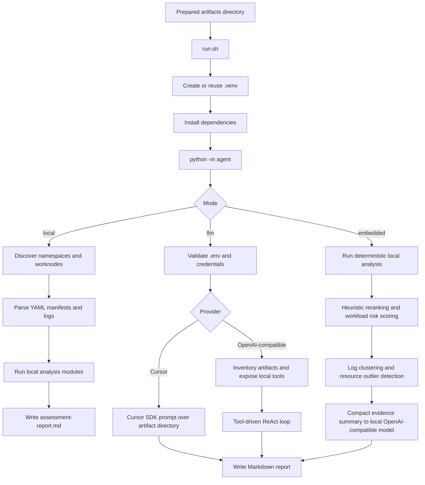

# kubeoptix-analyzer

Offline analyzer for OpenShift and Kubernetes application artifacts. It reads previously collected manifests, logs, and worker-node inventories, then generates a single Markdown assessment report.

Language versions: [PT-BR](README.pt-BR.md) | [Italiano](README.it.md)

## Overview

This project is the analysis stage of the KubeOptix workflow.

- `kubeoptix-analyzer` connects to a live OpenShift cluster, collects artifacts, removes `Secret` manifests, and anonymizes sensitive values.
- `kubeoptix-analyzer` consumes those prepared artifacts and produces an assessment report.

The upstream extraction and data-treatment process is documented in the harvester README:

- https://github.com/ShiftWise-AI/kubeoptix-analyzer/blob/main/README.md

According to that document, the artifact pipeline is:

1. Collect worker-node manifests.
2. Collect namespace resources and pod logs.
3. Remove YAML files whose `kind` is `Secret`.
4. Anonymize sensitive patterns in-place, including emails, tokens, certificates, keys, and other secrets.

This analyzer assumes those steps already happened before analysis starts.

## Requirements

- Python 3.9+
- Bash
- An artifact directory produced by `kubeoptix-analyzer` or another compatible collector

## Installation

```bash
python3 -m venv .venv
source .venv/bin/activate
python -m pip install --upgrade pip
python -m pip install -r requirements.txt
```

## Helm install on OpenShift

This repository now includes a Helm chart for deploying the analyzer API on OpenShift:

```text
helm/kubeoptix-analyzer
```

Install or upgrade:

```bash
helm upgrade --install kubeoptix-analyzer ./helm/kubeoptix-analyzer \
  --namespace shiftwise-ai \
  --create-namespace \
  -f /path/to/values.yaml
```

Using the project installer (recommended):

```bash
./install.sh -f ./helm/kubeoptix-analyzer/values.example.yaml
```

The installer runs a post-install orphan cleanup step by default to remove stale resources from the release (such as unused `ConfigMap`, `Secret`, and cert-manager objects when present).

Cleanup controls:

```bash
# Disable cleanup
POST_INSTALL_CLEANUP=false ./install.sh -f ./helm/kubeoptix-analyzer/values.example.yaml

# Keep cleanup enabled but run in dry-run mode
CLEANUP_DRY_RUN=true ./install.sh -f ./helm/kubeoptix-analyzer/values.example.yaml

# Restrict cleanup to selected kinds
CLEANUP_TARGET_KINDS=configmap,secret ./install.sh -f ./helm/kubeoptix-analyzer/values.example.yaml
```

Manual cleanup run:

```bash
RELEASE=kubeoptix-analyzer NS=shiftwise-ai DRY_RUN=true bash ./cleanup-ocp.sh
```

Notes:

- Reports are written to `/app/data/reports`.
- Input artifacts are read from `/app/data/assessment`.
- The API accepts `POST /run` with a JSON body containing `mode` and one or more `namespaces`.
- The API exposes `GET /status` with plain-text progress from `0` to `100`.
- The API exposes `DELETE /reports` to clear the contents of `/app/data/reports`.
- The chart enforces `replicaCount=1` and fails rendering if set to any other value.
- The chart can auto-select `storageClassName` (`persistence.storageClassName=auto`): it prefers the default class and falls back to the first available class.
- If `persistence.existingClaim` is set, the chart uses that PVC directly and does not create a new PVC.
- The API is exposed internally through a `ClusterIP` Service.
- The chart creates OpenShift `ImageStream` + `BuildConfig` by default.
- Default BuildConfig Git source: `https://github.com/ShiftWise-AI/kubeoptix-analyzer.git`.
- Source authentication uses an existing secret named `github-auth`.
- Analyzer runtime credentials are configured in `secretEnv`. By default the chart creates a secret with `CURSOR_API_KEY`, `CURSOR_MODEL`, `LLM_API_KEY`, `LLM_BASE_URL`, and `LLM_MODEL`.
- To reuse an existing secret for analyzer credentials, set `secretEnv.create=false` and `secretEnv.name=<secret-name>`.

Expected secret format (already available in your namespace):

```yaml
apiVersion: v1
kind: Secret
metadata:
  name: github-auth
type: kubernetes.io/basic-auth
stringData:
  username: x-access-token
  password: <github-token>
```

If needed, create it with:

```bash
oc -n shiftwise-ai create secret generic github-auth \
  --type=kubernetes.io/basic-auth \
  --from-literal=username='x-access-token' \
  --from-literal=password='<github-token>'
```

## API usage

The API uses the fixed runtime directories:

- `/app/data/assessment`
- `/app/data/reports`

Run the analysis:

```bash
curl -k -X POST https://analyzer-shiftwise-ai.apps-crc.testing/run \
  -H "Content-Type: application/json" \
  -d '{
    "mode": "local",
    "namespaces": ["openshift-console"]
  }'
```

Clear the reports directory:

```bash
curl -k -X DELETE https://analyzer-shiftwise-ai.apps-crc.testing/reports
```

## Supported input layout

The analyzer supports both of these layouts:

1. Resource-centric layout:

```text
<artifacts>/
  worknodes/
  <namespace>/
    resources/
      deployments.apps/
      services/
      routes.route.openshift.io/
      configmaps/
      pods/
      horizontalpodautoscalers.autoscaling/
      servicemonitors.monitoring.coreos.com/
      podmonitors.monitoring.coreos.com/
      prometheusrules.monitoring.coreos.com/
      clusterserviceversions.operators.coreos.com/
      subscriptions.operators.coreos.com/
      packagemanifests.packages.operators.coreos.com/
    pods-logs/
```

2. Legacy app-centric layout:

```text
<artifacts>/
  <namespace>/
    apps/
      <app>/
        deployments/
        services/
        routes/
        configmaps/
        hpa/
        pod-logs/
```

## Configuration

The CLI loads variables from `.env` in the project root.

Example:

```dotenv
CURSOR_API_KEY=
CURSOR_MODEL=composer-2.5

# Alternative OpenAI-compatible provider
# LLM_API_KEY=
# LLM_BASE_URL=https://api.openai.com/v1
# LLM_MODEL=gpt-4o-mini
```

LLM mode now validates the `.env` file before running:

- if `.env` does not exist, execution stops with a friendly error
- if both `CURSOR_API_KEY` and `LLM_API_KEY` are empty, execution stops with a friendly error

Embedded mode uses a local OpenAI-compatible endpoint. Example with Ollama and a quantized Mistral 7B Instruct variant:

```dotenv
EMBEDDED_BASE_URL=http://127.0.0.1:11434/v1
EMBEDDED_API_KEY=ollama
EMBEDDED_MODEL=mistral
EMBEDDED_TIMEOUT_S=120
```

## Report locale

The CLI supports report internationalization through `--locale`.

Supported values:

- `pt-BR` (default)
- `en-US`
- `es-ES`
- `it-IT`

If `--locale` is omitted, the report is generated in `pt-BR`.

## Execution flow

### 1. Prepare or collect artifacts

Use `kubeoptix-analyzer` first to export cluster data, remove `Secret` manifests, and anonymize sensitive content.

### 2. Install dependencies

```bash
./run.sh --help
```

When you run the wrapper script for the first time, it will:

1. Resolve the project root.
2. Create `.venv/` if it does not exist.
3. Activate the virtual environment.
4. Upgrade `pip`.
5. Install dependencies from `requirements.txt`.
6. Start `python -m agent` with the same CLI arguments.

### 3. Run the analyzer

Local mode:

```bash
./run.sh --artifacts ./artifacts
```

LLM mode:

```bash
./run.sh --artifacts ./artifacts --mode llm
```

Embedded mode:

```bash
./run.sh --artifacts ./artifacts --mode embedded
```

Custom locale:

```bash
./run.sh --artifacts ./artifacts --mode local --locale en-US
./run.sh --artifacts ./artifacts --mode embedded --locale es-ES
./run.sh --artifacts ./artifacts --mode llm --locale it-IT
```

Custom report path:

```bash
./run.sh --artifacts ./artifacts --report ./out/assessment-report.md
```

### 4. Choose the analysis mode

`local`

- deterministic analysis without external LLM calls
- scans manifests, routes, services, ConfigMaps, logs, operators, HPAs, and worker-node capacity
- writes one Markdown report directly from local heuristics
- translates the final Markdown to the locale selected with `--locale`

`llm`

- validates that `.env` exists and contains credentials
- if `CURSOR_API_KEY` is set, uses Cursor SDK
- otherwise, if `LLM_API_KEY` is set, uses an OpenAI-compatible API and a tool-driven ReAct loop
- writes a single Markdown report to the artifact directory or the path passed with `--report`
- instructs the model to answer in the locale selected with `--locale`

`embedded`

- runs the deterministic local analysis first
- computes heuristic classification + reranking of findings
- clusters repeated log errors by normalized signature
- scores workload risk using findings, logs, QoS, missing limits/requests, and replica posture
- detects requests/limits outliers with IQR-based analysis
- sends only the compact evidence summary to a local OpenAI-compatible model such as Ollama + Mistral
- translates the final Markdown to the locale selected with `--locale`

### 5. Review the output

By default, the generated file is:

```text
<artifacts>/assessment-report.md
```

The report covers inventory, topology, resources, observability, ConfigMap security checks, findings, action plan, and references.

## Internal analyzer flow



## What local mode analyzes

- namespace discovery
- application inventory
- topology inferred from Deployments, Services, Routes, and ConfigMaps
- CPU and memory requests and limits
- worker-node allocatable and capacity totals
- HPA and observability-related resources
- log error patterns such as crashes, OOM, timeouts, and connection failures
- risky configuration patterns in manifests and ConfigMaps
- operator inventory from CSVs, Subscriptions, and PackageManifests

## Main commands

Show CLI help:

```bash
python -m agent --help
```

Run local analysis directly:

```bash
python -m agent --artifacts ./artifacts --mode local
```

Run LLM analysis directly:

```bash
python -m agent --artifacts ./artifacts --mode llm
```

Run embedded analysis directly:

```bash
python -m agent --artifacts ./artifacts --mode embedded
```

Run with a specific report locale:

```bash
python -m agent --artifacts ./artifacts --mode local --locale en-US
```

## Notes

- The analyzer is offline with respect to cluster access. It only reads local artifacts.
- The quality of the report depends on the completeness of the collected artifacts.
- LLM mode does not replace artifact sanitization. Sensitive-data removal should happen upstream in the harvester pipeline.

## Language versions

- [English](README.md)
- [PT-BR](README.pt-BR.md)
- [Italiano](README.it.md)