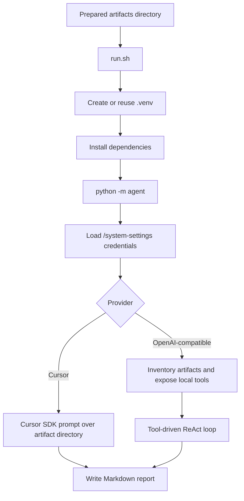

# kubeoptix-analyzer

`kubeoptix-analyzer` is an OpenShift and Kubernetes assessment tool that reads previously collected workload artifacts, inspects their configuration and runtime metadata, and produces a Markdown report with findings, risks, and suggested remediation actions.

The project is designed for artifact-based analysis rather than live cluster mutation. It expects pre-collected manifests, logs, and worker-node inventory to already exist in a structured directory before execution. The analyzer then reviews workloads, services, routes, ConfigMaps, operators, and observability data to identify configuration and reliability issues.

## Features

- Parses Kubernetes and OpenShift YAML manifests from collected artifacts.
- Evaluates workloads, services, routes, ConfigMaps, and operators for configuration risk.
- Reviews CPU and memory requests/limits, HPA signals, and node capacity.
- Identifies missing readiness/liveness probes, insecure routes, and common misconfigurations.
- Scans logs for error patterns and observability gaps.
- Produces a Markdown assessment report for a namespace or for all discovered namespaces.
- Runs as a CLI or through an HTTP API in a containerized OpenShift deployment.

## Requirements

- Python 3.9+
- Bash
- Helm 3 (for OpenShift deployment)
- OpenShift or Kubernetes cluster access for artifact collection and deployment
- A prepared artifact directory containing collected manifests, logs, and node data
- Optional: `oc` CLI for the Helm/OpenShift installation flow

## Technologies

- Python 3 for the analyzer logic and API
- OpenShift and Kubernetes manifest parsing
- Helm chart for deployment in OpenShift
- Containerfile/OCI image build for runtime packaging
- HTTP API using Python standard library (`http.server`)
- `.env`-based configuration for LLM and cursor integrations
- Git-based image builds and OpenShift `BuildConfig`/`ImageStream` resources

## Project Structure

```text
.
├── agent/                     # Assessment logic and analysis modules
│   ├── analysis/             # Namespace and workload analysis
│   ├── tools/                # Artifact inspection helpers
│   ├── __main__.py           # CLI entry point
│   ├── agent.py              # ReAct orchestration loop
│   ├── config.py             # Runtime settings
│   ├── llm.py                # LLM client integration
│   ├── prompts.py            # System and user prompts
│   ├── local_analyze.py      # Report path helpers and legacy local analysis modules
│   └── report.py             # Report builder
├── helm/kubeoptix-analyzer/  # Helm chart for OpenShift deployment
│   ├── templates/            # Kubernetes manifests
│   ├── Chart.yaml            # Chart metadata
│   ├── values.yaml           # Default chart values
│   └── values.example.yaml   # Example deployment configuration
├── api.py                    # HTTP service API
├── Containerfile             # Container image definition
├── install.sh                # OpenShift install helper
├── cleanup-ocp.sh            # Post-install cleanup utility
├── run.sh                    # Local CLI bootstrap script
├── run-ocp.sh               # Minimal entry script for OpenShift runtime
├── requirements.txt          # Python dependencies
├── README.md                 # Project documentation
├── .env.example              # Example environment config (if present in the repo)
└── data/                     # Runtime data directory expected at runtime
```

## Configuration

In OpenShift, runtime credentials are loaded from the platform API:

- `GET {SYSTEM_SETTINGS_URL}/system-settings`
- fields used: `cursorApiKey`, `cursorModel`, `llmApiKey`, `llmModel`, `status`

For local development, configure `.env`:

```dotenv
SYSTEM_SETTINGS_URL=http://localhost:8000

# Optional fallback when SYSTEM_SETTINGS_URL is not set
# CURSOR_API_KEY=
# CURSOR_MODEL=composer-2.5
# LLM_API_KEY=
# LLM_BASE_URL=https://api.openai.com/v1
# LLM_MODEL=gpt-4o-mini
```

The Helm chart exposes runtime configuration through `values.yaml`:

- `build.enabled` and `build.git.*` for the OpenShift image build
- `systemSettings.url` for the platform System Settings API base URL
- `service.api.*` for the Service definition
- `persistence.*` for storage configuration
- `resources.*` for CPU and memory requests/limits
- `podEnv.*` for environment variables in the workload

The API runtime directories are fixed:

- `/app/data/assessment`
- `/app/data/reports`

The `api.py` service accepts a POST request to `/run` with `namespaces`, and exposes a `GET /status` endpoint for progress reporting.

## Installation

Install dependencies for local execution:

```bash
python3 -m venv .venv
source .venv/bin/activate
python -m pip install --upgrade pip
python -m pip install -r requirements.txt
```

Deploy to OpenShift with the existing Helm chart:

```bash
helm upgrade --install kubeoptix-analyzer ./helm/kubeoptix-analyzer \
  --namespace shiftwise-ai \
  --create-namespace \
  -f ./helm/kubeoptix-analyzer/values.example.yaml
```

The repository also ships with an installer helper:

```bash
./install.sh -f ./helm/kubeoptix-analyzer/values.example.yaml
```

## Helm Configuration

The chart name is `kubeoptix-analyzer` and it deploys the application on OpenShift by creating the following primary resources:

- `StatefulSet` for the analyzer runtime
- `Service` for the API endpoint
- `ImageStream` and `BuildConfig` when build automation is enabled
- optional `Secret` creation for runtime environment variables
- optional persistent storage when `persistence.enabled` is set

Key values in the chart include:

```yaml
deploy:
  enabled: true

service:
  api:
    enabled: true
    name: analyzer-api
    type: ClusterIP
    port: 8000
    targetPort: 8000

build:
  enabled: true
  registryHost: image-registry.openshift-image-registry.svc:5000
  imageStreamName: ""
  outputTag: latest
  containerfilePath: Containerfile
  git:
    uri: ""
    ref: main
    sourceSecret: ""

systemSettings:
  url: "http://shiftwise-backend:8080"

env:
  LLM_BASE_URL: https://api.openai.com/v1
```

`install.sh` also supports post-install cleanup options for orphaned OpenShift resources. Those are optional and can be disabled or restricted with environment variables such as `POST_INSTALL_CLEANUP`, `CLEANUP_DRY_RUN`, and `CLEANUP_TARGET_KINDS`.

## Running Locally

The local execution path is driven by the project scripts:

```bash
./run.sh --help
./run.sh --artifacts ./data/assessment --report ./data/reports
```

The analyzer expects a prepared artifact tree similar to:

```text
<artifacts>/
  worknodes/
  <namespace>/
    resources/
    pods-logs/
```

The output report is written to the selected report path or to the default generated report inside the artifact directory.

## Development

To prepare a development environment:

```bash
python3 -m venv .venv
source .venv/bin/activate
python -m pip install --upgrade pip
python -m pip install -r requirements.txt
```

Then run the analyzer directly:

```bash
python -m agent --artifacts ./data/assessment
```

The repository does not include a dedicated test suite in the visible project tree, so validation is primarily done through CLI execution, artifact inspection, and deployment checks.

## Container

The project contains a `Containerfile` that builds the analyzer runtime image. The runtime is designed to read artifact directories from `/app/data` and writes generated reports to `/app/data/reports`.

Build the image from the repository root:

```bash
podman build -t kubeoptix-analyzer .
```

## Deployment

The application is deployed in OpenShift with the Helm chart under `helm/kubeoptix-analyzer`. The chart creates the runtime workload and service, and it can optionally build the image from source with OpenShift `BuildConfig` and `ImageStream` resources.

The installation flow in `install.sh` performs a two-phase deployment:

1. Deploy build resources and trigger the OpenShift image build.
2. Deploy the runtime workload and verify the service is healthy.

## Troubleshooting

- If the artifact directory is missing or malformed, the analyzer exits with a clear path error.
- If `SYSTEM_SETTINGS_URL` is unreachable, returns inactive status, or provides no API keys, the runtime stops before analysis begins.
- If the Helm installation cannot find the release namespace or build config, verify the namespace exists and the chart was installed with the correct values file.
- If the application fails health checks, inspect the pod logs and the service proxy status in OpenShift.

## License

No explicit license file was identified in this repository, so no license is documented here.

When you run the wrapper script for the first time, it will:

1. Resolve the project root.
2. Create `.venv/` if it does not exist.
3. Activate the virtual environment.
4. Upgrade `pip`.
5. Install dependencies from `requirements.txt`.
6. Start `python -m agent` with the same CLI arguments.

### 3. Run the analyzer

```bash
./run.sh --artifacts ./artifacts
```

Custom report path:

```bash
./run.sh --artifacts ./artifacts --report ./out/assessment-report.md
```

### 4. How analysis works

- loads credentials from `GET /system-settings` when `SYSTEM_SETTINGS_URL` is configured
- if `cursorApiKey` is present, uses Cursor SDK
- otherwise, if `llmApiKey` is present, uses an OpenAI-compatible API and a tool-driven ReAct loop
- writes a single Markdown report in Brazilian Portuguese to the artifact directory or the path passed with `--report`

### 5. Review the output

By default, the generated file is:

```text
<artifacts>/assessment-report.md
```

The report covers inventory, topology, resources, observability, ConfigMap security checks, findings, action plan, and references.

## Internal analyzer flow



## What the assessment covers

- namespace discovery
- application inventory
- topology inferred from Deployments, Services, Routes, and ConfigMaps
- CPU and memory requests and limits
- worker-node allocatable and capacity totals
- HPA and observability-related resources
- log error patterns such as crashes, OOM, timeouts, and connection failures
- risky configuration patterns in manifests and ConfigMaps
- operator inventory from CSVs, Subscriptions, and PackageManifests

## Main commands

Show CLI help:

```bash
python -m agent --help
```

Run analysis directly:

```bash
python -m agent --artifacts ./artifacts
```

## Notes

- The analyzer is offline with respect to cluster access. It only reads local artifacts.
- The quality of the report depends on the completeness of the collected artifacts.
- Generative analysis does not replace artifact sanitization. Sensitive-data removal should happen upstream in the harvester pipeline.
