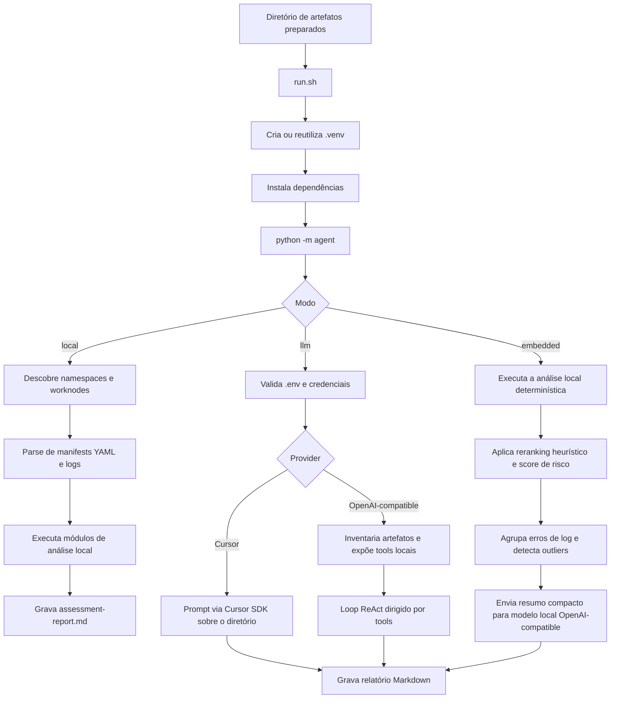

# kubeoptix-analyzer

Analisador offline de artefatos de aplicações OpenShift e Kubernetes. Ele lê manifests, logs e inventário de worker nodes já coletados e gera um único relatório Markdown.

Versões do documento: [English](README.md) | [Italiano](README.it.md)

## Visão geral

Este projeto é a etapa de análise do fluxo KubeOptix.

- `kubeoptix-harvester` conecta em um cluster OpenShift em execução, coleta os artefatos, remove manifests `Secret` e anonimiza valores sensíveis.
- `kubeoptix-analyzer` consome esses artefatos preparados e produz um relatório de assessment.

O processo upstream de extração e tratamento de dados está documentado no README do harvester:

- https://github.com/ShiftWise-AI/kubeoptix-harvester/blob/main/README.md

De acordo com esse documento, o pipeline dos artefatos é:

1. Coletar os manifests dos worker nodes.
2. Coletar recursos dos namespaces e logs dos pods.
3. Remover os arquivos YAML cujo `kind` seja `Secret`.
4. Anonimizar in-place padrões sensíveis, como emails, tokens, certificados, chaves e outros segredos.

Este analyzer assume que essas etapas já aconteceram antes do início da análise.

## Requisitos

- Python 3.9+
- Bash
- Um diretório de artefatos gerado pelo `kubeoptix-harvester` ou por outro coletor compatível

## Instalação

```bash
python3 -m venv .venv
source .venv/bin/activate
python -m pip install --upgrade pip
python -m pip install -r requirements.txt
```

## Layout de entrada suportado

O analyzer aceita os dois layouts abaixo.

1. Layout orientado a recursos:

```text
<artifacts>/
  worknodes/
  <namespace>/
    resources/
      deployments.apps/
      services/
      routes.route.openshift.io/
      configmaps/
      pods/
      horizontalpodautoscalers.autoscaling/
      servicemonitors.monitoring.coreos.com/
      podmonitors.monitoring.coreos.com/
      prometheusrules.monitoring.coreos.com/
      clusterserviceversions.operators.coreos.com/
      subscriptions.operators.coreos.com/
      packagemanifests.packages.operators.coreos.com/
    pods-logs/
```

2. Layout legado orientado a aplicacao:

```text
<artifacts>/
  <namespace>/
    apps/
      <app>/
        deployments/
        services/
        routes/
        configmaps/
        hpa/
        pod-logs/
```

## Configuração

O CLI carrega variáveis do arquivo `.env` na raiz do projeto.

Exemplo:

```dotenv
CURSOR_API_KEY=
CURSOR_MODEL=composer-2.5

# Alternativa OpenAI-compatible
# LLM_API_KEY=
# LLM_BASE_URL=https://api.openai.com/v1
# LLM_MODEL=gpt-4o-mini
```

O modo LLM agora valida o `.env` antes de executar:

- se o `.env` não existir, a execução para com erro amigável
- se `CURSOR_API_KEY` e `LLM_API_KEY` estiverem vazias, a execução para com erro amigável

O modo embedded usa um endpoint local OpenAI-compatible. Exemplo com Ollama e uma variante quantizada de Mistral 7B Instruct:

```dotenv
EMBEDDED_BASE_URL=http://127.0.0.1:11434/v1
EMBEDDED_API_KEY=ollama
EMBEDDED_MODEL=mistral
EMBEDDED_TIMEOUT_S=120
```

## Idioma do relatório

O CLI suporta internacionalização do relatório pelo parâmetro `--locale`.

Valores suportados:

- `pt-BR` (padrão)
- `en-US`
- `es-ES`
- `it-IT`

Se `--locale` não for informado, o relatório será gerado em `pt-BR`.

## Fluxo de execução

### 1. Preparar ou coletar os artefatos

Use o `kubeoptix-harvester` primeiro para exportar os dados do cluster, remover manifests `Secret` e anonimizar o conteúdo sensível.

### 2. Instalar dependências

```bash
./run.sh --help
```

Na primeira execução do script wrapper, ele vai:

1. Resolver a raiz do projeto.
2. Criar `.venv/` se ela não existir.
3. Ativar o ambiente virtual.
4. Atualizar o `pip`.
5. Instalar as dependências de `requirements.txt`.
6. Iniciar `python -m agent` com os mesmos argumentos de CLI.

### 3. Executar o analyzer

Modo local:

```bash
./run.sh --artifacts ./artifacts
```

Modo LLM:

```bash
./run.sh --artifacts ./artifacts --mode llm
```

Modo embedded:

```bash
./run.sh --artifacts ./artifacts --mode embedded
```

Locale customizado:

```bash
./run.sh --artifacts ./artifacts --mode local --locale en-US
./run.sh --artifacts ./artifacts --mode embedded --locale es-ES
./run.sh --artifacts ./artifacts --mode llm --locale it-IT
```

Caminho customizado do relatório:

```bash
./run.sh --artifacts ./artifacts --report ./out/assessment-report.md
```

### 4. Escolher o modo de análise

`local`

- análise determinística sem chamadas externas para LLM
- varre manifests, routes, services, ConfigMaps, logs, operadores, HPAs e capacidade dos worker nodes
- grava um relatório Markdown diretamente a partir de heurísticas locais
- traduz o Markdown final para o locale selecionado em `--locale`

`llm`

- valida que existe `.env` com credenciais
- se `CURSOR_API_KEY` estiver definida, usa Cursor SDK
- caso contrário, se `LLM_API_KEY` estiver definida, usa uma API OpenAI-compatible e um loop ReAct dirigido por tools
- grava um único relatório Markdown no diretório de artefatos ou no caminho informado em `--report`
- instrui o modelo a responder no locale selecionado em `--locale`

`embedded`

- executa primeiro a análise local determinística
- calcula classificação heurística + reranking dos achados
- agrupa erros de log repetidos por assinatura normalizada
- calcula score de risco por workload com base em achados, logs, QoS, ausência de limits/requests e postura de réplicas
- detecta outliers de requests/limits com análise baseada em IQR
- envia apenas um resumo compacto das evidências para um modelo local OpenAI-compatible, como Ollama + Mistral
- traduz o Markdown final para o locale selecionado em `--locale`

### 5. Revisar a saída

Por padrão, o arquivo gerado é:

```text
<artifacts>/assessment-report.md
```

O relatório cobre inventário, topologia, recursos, observabilidade, verificações de segurança em ConfigMaps, achados, plano de ação e referências.

## Fluxo interno do analyzer



  ## O que o modo local analisa

- descoberta de namespaces
  - inventário de aplicações
  - topologia inferida de Deployments, Services, Routes e ConfigMaps
  - requests e limits de CPU e memória
- totais allocatable e capacity dos worker nodes
  - recursos relacionados a HPA e observabilidade
  - padrões de erro em logs, como crash, OOM, timeout e falha de conexão
  - padrões arriscados de configuração em manifests e ConfigMaps
- inventario de operadores a partir de CSVs, Subscriptions e PackageManifests

## Comandos principais

  Exibir ajuda do CLI:

```bash
python -m agent --help
```

Executar análise local diretamente:

```bash
python -m agent --artifacts ./artifacts --mode local
```

Executar análise LLM diretamente:

```bash
python -m agent --artifacts ./artifacts --mode llm
```

Executar análise embedded diretamente:

```bash
python -m agent --artifacts ./artifacts --mode embedded
```

Executar com locale específico:

```bash
python -m agent --artifacts ./artifacts --mode local --locale en-US
```

## Observações

- O analyzer é offline em relação ao cluster. Ele apenas lê artefatos locais.
- A qualidade do relatório depende da completude dos artefatos coletados.
- O modo LLM não substitui a sanitização dos artefatos. A remoção de dados sensíveis deve acontecer antes, no pipeline do harvester.

## Versões do documento

- [English](README.md)
- [PT-BR](README.pt-BR.md)
- [Italiano](README.it.md)